# Laboration Deep Learning

In this project we will experiment and compare CNN models for classifying dog and cat pictures. The data provided can be found <here> and it's a dataset of approximately 27500 pictures of dogs and cats. 

To create and study the models we will proceed as follows : 
- EDA : 
    - Data analysis 
    - Splitting data on folders 
    - Checking if the data is well balanced 
    - Checking if the data is well shuffled

- Image treatment : 
    - Checking sizes and resizing to an optimal size 
    - Creating an initial dataframe for the dataset and removing unwanted data
    - Visualizing the data
    - Creating X and y arrays for each portion of the data
    - Data augmentation 
    - Visualizing the augmented data to control quality

- Model training 
    - Hyper parameter tuning 
    - Training models with the chosen parameters
    - Evaluating all models on val data 
    - Evaluating the best model on test data 
    - Transfer learning : 
        - Training the models and evaluate 

## 1. EDA 
### Data analysis : 

We started by making a plot of randomly chosen images from the original data folder as follows :  
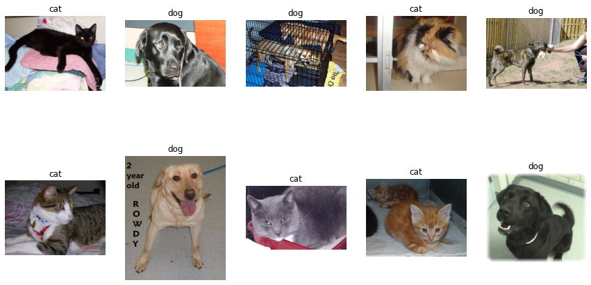

### Splitting the data : 

Data was split following these numbers : 
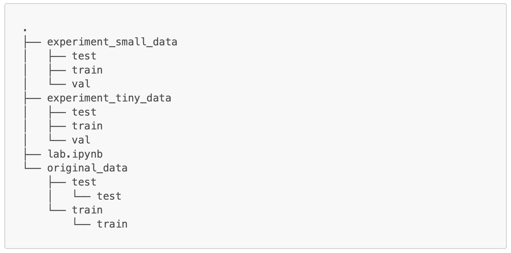

### Data balance : 

To check the data balance we made a pie chart of the proportions of cat images and dog images in the dataset. The data is perfectly balanced since we're making sure we take 50% of each while splitting the data.

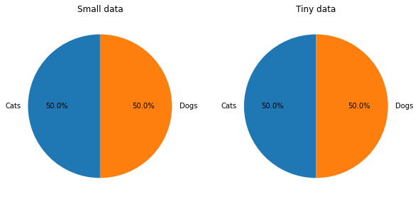

### Data shuffling : 

To control if the data is well shuffled, it is easier to make a lineplot of the label array. What we don't want to see in this case is continuous horizontal lines. 

As we see on the following plot, the data is well shuffled.

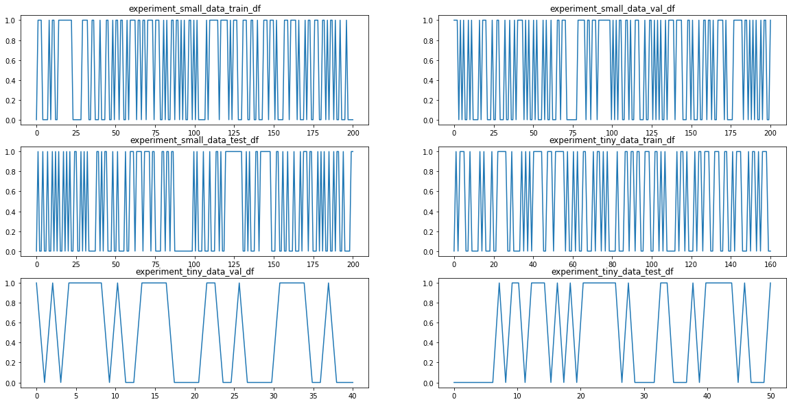

## 2. Image treatment : 
### Size : 

The initial sizes of the pictures are as shown in this graph : 
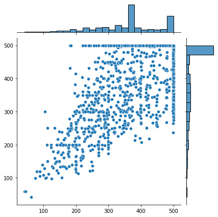

The graph shows that the majority of the images tend to be close to a square shape. We will resize the images to a 1:1 ratio images. 

When resizing we don't want to have a large portion of our data that has a lower size than our resizing dimensions, the reason for that are that images tend to lose significantly more quality when resized to a larger size.

We will resize our images to 200x200 without cropping. We will not crop our pictures because we will be performing data augmentation later in this process, and the compound of cropping and the translation effect may have produce images where the subject is completely out of the image.

Images under 100pixel in height or weights will be removed. 
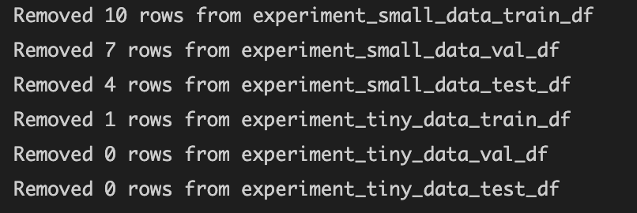

### Visualizing the data : 

Checking the quality of the resized images : 
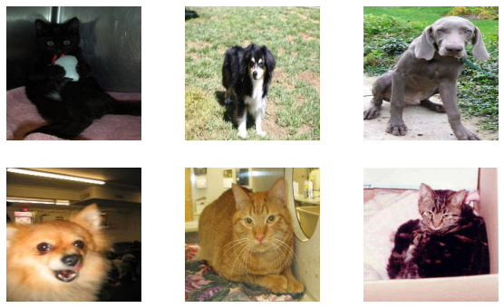

### Data augmentation : 

After scaling the data and creating the datasets, we created the X and y arrays for each of the folders. To keep track of our X and y arrays we will store them in a dictionary we call scaled_data_dict. 

To augment our data, we go through the x_train data and produce 5 new imeges through the ImageDataGenerator iterator object. 

### Visualizing the augmented data to control quality : 

Here we make a plot of images from the augmented data to check quality and labeling : 

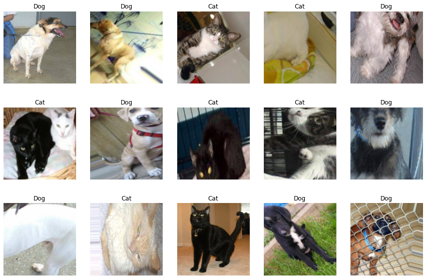

## 3. Model training :
### Hyper parameter tuning :

The parameters we will be tuning are : 
- Drop out rate 
- Number of layers 
- learning rate

We ran a test first to find the best dropout rate for each of the datasets, and the results are as follows : 
#### Small data : 
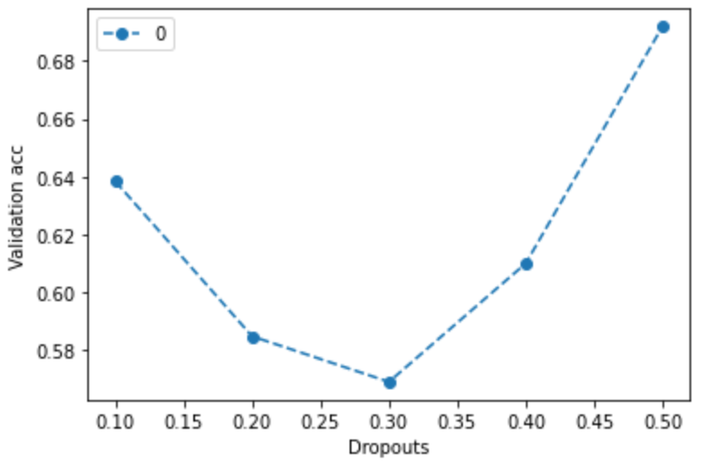
    
#### Augmented small data : 
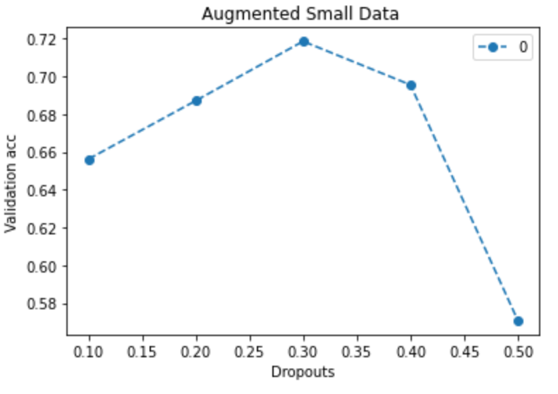
    
#### Tiny data : 
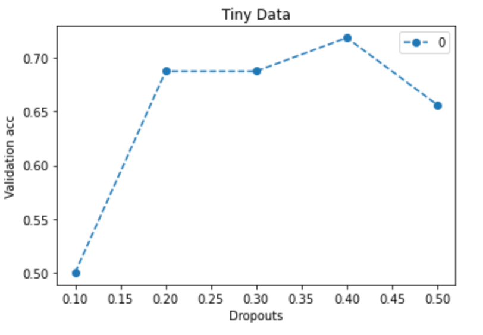
    
#### Augmented tiny data : 
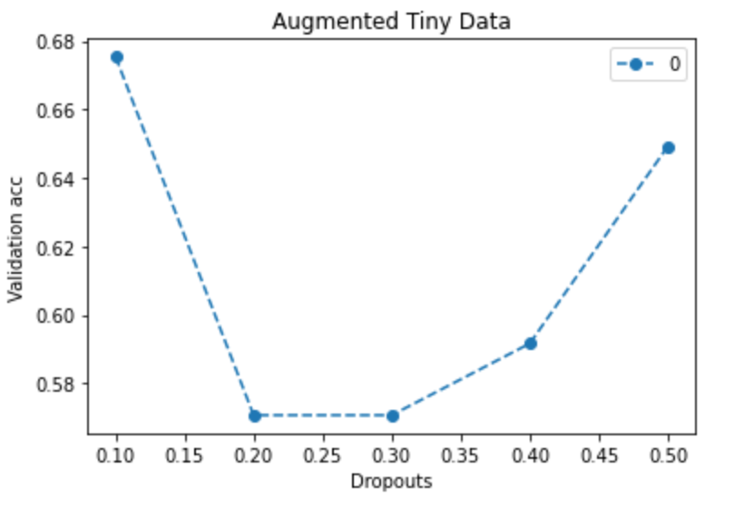

Then we ran 2 nested loops to cross test learning rates (0.001,0.01,0.1)and number of layers from 2 to 4. The models are then saved with model name containing the parameters as well as the validation accuracy to help us keep track of different models, as follows : 
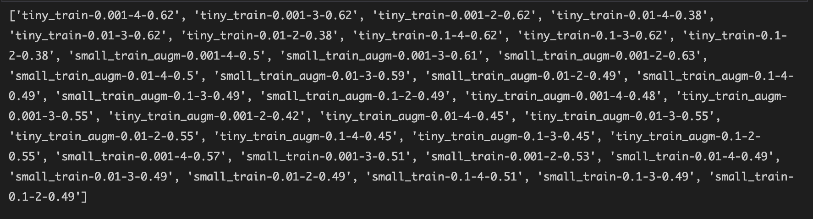

From the initial results, the best parameters are in the following table : 

| Data  | Dropout rate | Learning rate | Number of layers |
|-------|--------------|---------------|------------------|
| small | 0.5          |       0.001   |          4        |
|     augmented small  |     0.3      |       0.001   |        2        |
|    tiny   |        0.4      |       0.001   |            4      |
|  augmented tiny     |       0.1       |       0.001   |    3          |

### Training models with the chosen parameters and evaluating all models on val data :

The best performing models for each of the datasets were as follow : 

| Data  | Train val accuracy | Validation data acc | 
|-------|--------------|---------------|
| small | 0.698         |       0.679   |
|     augmented small  |     0.621      |       0.659   |
|    tiny   |        0.5      |       0.675   |
|  augmented tiny     |       0.594       |       0.625   |

The augmented small data models performed very poorly, we believe that it was a mistake to create the model for that data with only 2 convolutional layers. We decided to run more tests with both 4 and 5 convolutional layers and the results showed that the models trained on the augmented small data with 5 convolutional layers performed best with a validation accuracy of 0.814 . 

The best performing model for the tiny dataset will remain the same as the previous table.

### Evaluating the best model on test data :
#### Small data model : 
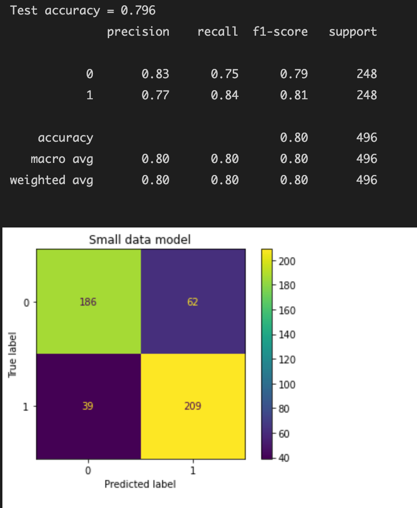

#### Tiny data model : 

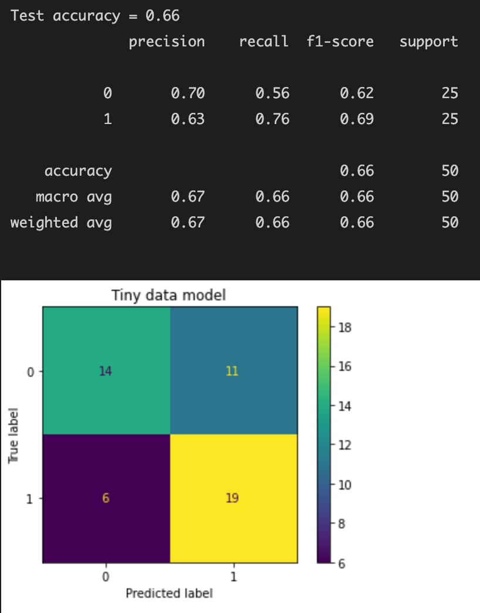

## Transfer learning with InceptionV3 :

### Training the models and evaluate :

## Transfer Learning : Inception 

### 1. Introduction : 

AlexNet, an image network that won the 2012 ImageNet best-of-breed competition, is also popularly used for different activities, such as object-detection, segmentation, human pose calculation, video type interpretation, object tracking, and superresolution.

These network architectures motivated research efforts that led to improved convolutional neural networks. Among these networks, VGGNet and GoogLeNet delivered results in 2014 that surpassed those of all other networks in ImageNet classification.

VGGNet has the benefit of being very simple to configure and implement, but its computational constraints need to be carefully assessed, and Inception doesn't.

Inception is also substantially less expensive than VGGNet and its higher performing successors. This allows it to operate effectively in big-data scenarios, where a large amount of information needs to be processed at low cost or in scenarios where memory and computational power is limited, for instance, in mobile vision.

### 2. General Design Principles :
### 3. Factorizing Convolutions with Large Filter Size : 
#### 3.1. Factorization into smaller convolutions :
#### 3.2. Spatial Factorization into Asymmetric Convolutions :
### 4. Utility of Auxiliary Classifiers :
### 5. Efficient Grid Size Reduction :
### 6. Inception-v2 :
### 7. Model Regularization via Label Smoothing :
### 8. Training Methodology :
### 9. Performance on Lower Resolution Input :
### 10. Experimental Results and Comparisons :
### 11. Conclusions :
