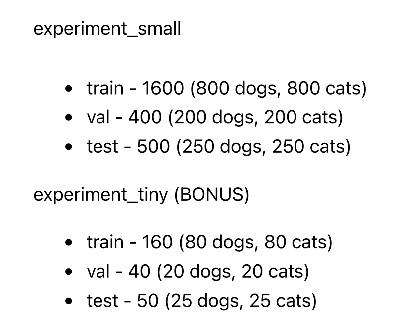

# Laboration Deep Learning

In this project we will experiment and compare CNN models for classifying dog and cat pictures. The data provided can be found [here](https://www.kaggle.com/datasets/biaiscience/dogs-vs-cats) and it's a dataset of approximately 27500 pictures of dogs and cats. 

To create and study the models we will proceed as follows : 
- EDA : 
    - Data analysis 
    - Splitting data on folders 
    - Checking if the data is well balanced 
    - Checking if the data is well shuffled

- Image treatment : 
    - Checking sizes and resizing to an optimal size 
    - Creating an initial dataframe for the dataset and removing unwanted data
    - Visualizing the data
    - Creating X and y arrays for each portion of the data
    - Data augmentation 
    - Visualizing the augmented data to control quality

- Model training 
    - Hyper parameter tuning 
    - Training models with the chosen parameters
    - Evaluating all models on val data 
    - Evaluating the best model on test data 
    - Transfer learning : 
        - Training the models and evaluate 

## 1. EDA 
### Data analysis : 

We started by making a plot of randomly chosen images from the original data folder as follows :  

### Splitting the data : 

Data was split following these numbers : 

### Data balance : 

To check the data balance we made a pie chart of the proportions of cat images and dog images in the dataset. The data is perfectly balanced since we're making sure we take 50% of each while splitting the data.

### Data shuffling : 

To control if the data is well shuffled, it is easier to make a lineplot of the label array. What we don't want to see in this case is continuous horizontal lines. 

As we see on the following plot, the data is well shuffled.

## 2. Image treatment : 
### Size : 

The initial sizes of the pictures are as shown in this graph : 

The graph shows that the majority of the images tend to be close to a square shape. We will resize the images to a 1:1 ratio images. 

When resizing we don't want to have a large portion of our data that has a lower size than our resizing dimensions, the reason for that are that images tend to lose significantly more quality when resized to a larger size.

We will resize our images to 200x200 without cropping. We will not crop our pictures because we will be performing data augmentation later in this process, and the compound of cropping and the translation effect may have produce images where the subject is completely out of the image.

Images under 100pixel in height or weights will be removed. 

### Visualizing the data : 

Checking the quality of the resized images : 

### Data augmentation : 

After scaling the data and creating the datasets, we created the X and y arrays for each of the folders. To keep track of our X and y arrays we will store them in a dictionary we call scaled_data_dict. 

To augment our data, we go through the x_train data and produce 5 new images for each image in our X_train through the ImageDataGenerator iterator object. 

### Visualizing the augmented data to control quality : 

Here we make a plot of images from the augmented data to check quality and labeling : 

## 3. Model training :
### Hyper parameter tuning :

The parameters we will be tuning are : 
- Drop out rate 
- Number of layers 
- learning rate

We ran a test first to find the best dropout rate for each of the datasets, and the results are as follows : 
#### Small data : 

#### Augmented small data : 

#### Tiny data : 

#### Augmented tiny data : 

Then we ran 2 nested loops to cross test learning rates (0.001,0.01,0.1)and number of layers from 2 to 4. The models are then saved with model name containing the parameters as well as the validation accuracy to help us keep track of different models, as follows : 

From the initial results, the best parameters are in the following table : 

| Data  | Dropout rate | Learning rate | Number of layers |
|-------|--------------|---------------|------------------|
| small | 0.5          |       0.001   |          4        |
|     augmented small  |     0.3      |       0.001   |        2        |
|    tiny   |        0.4      |       0.001   |            4      |
|  augmented tiny     |       0.1       |       0.001   |    3          |

### Training models with the chosen parameters and evaluating all models on val data :

The best performing models for each of the datasets were as follow : 

| Data  | Train val accuracy | Validation data acc | 
|-------|--------------|---------------|
| small | 0.698         |       0.679   |
|     augmented small  |     0.621      |       0.659   |
|    tiny   |        0.5      |       0.675   |
|  augmented tiny     |       0.594       |       0.625   |

The augmented small data models performed very poorly, we believe that it was a mistake to create the model for that data with only 2 convolutional layers. We decided to run more tests with both 4 and 5 convolutional layers and the results showed that the models trained on the augmented small data with 5 convolutional layers performed best with a validation accuracy of 0.814 . 

The best performing model for the tiny dataset will remain the same as the previous table.

### Evaluating the best model on test data :
#### Small data model : 

#### Tiny data model : 

## Transfer learning with InceptionV3 :

An inception network is a deep neural network with an architectural design that consists of repetitive elements called Inception modules.

Network in Network was a paper published in the year 2014 by Min Lin, and it highlighted the increase in representational power of neural networks through the integration of internal complex structures within networks.

The network is known to have gotten its name after the famous movie Inception released back in 2010. 

### How does it work : 
A few principles guided the researchers when designing the Inception network : 

- Highly efficient deep neural networks need to be large. A deep neural network that's truly efficient must be larger-meaning it must contain more layers and units in its various layers.
- Convolutional neural networks are capable of detecting details at different scales due to their biological visual cortex functions. This increases the visual cortex's capability to discover larger visual patterns, which allows it to better recognize objects. As a result, multiscale convolutional neural networks tend to learn more.
- Considering that neurons that fire together, wire together.(The Hebbian Principle)

In practice, an Inception network is made out of inception modules. Each inception module consists of :
- Input layer
- 1x1 convolution layer
- 3x3 convolution layer
- 5x5 convolution layer
- Max pooling layer
- Concatenation layer

### 1x1 convolution layers : 
Also known as “Network In Network” and was introduced in 2013, the 1x1 convolutional layers's main purpose is to reduce the dimension of data going through the network.

### 3x3 and 5x5 Convolutions :
Before the inception model, researchers had to test a variation of kernels and filter sizes. With the Inception model there is no need anymore to make such decisions, instead we will use varying filter sizes ( 1x1, 3x3, 5x5).

These 2 types of layers' main purpose is  to let the network learn multiple spatial patterns at different scales as a result of the varying convolution filter sizes.

### Benefits of the inception modules 
Efficient utilisation of computing resource with minimal increase in computation load for the high-performance output of an Inception network.

Ability to extract features from input data at varying scales through the utilisation of 1x1, 3x3 and 5x5 convolutional filter sizes. 

1x1 conv filters can learn cross channels patterns, which contributes to the overall feature extractions capabilities of the network.

### Conclusion 
The inception network can be easily understood when broken down into its components. It is a good network for data science practicioners to learn more about the intuitions as well as the techniques the researchers might have or are working on developing.

## Training and evaluating the models :

#### Small data : 

#### Tiny data : 

# Conclusion : 

Through out this project we learned several things about convolutional neural networks : 
- The bigger the data the better: The conv models we trained locally performed way better. 
- Small data can give ambiguous results : The tiny data was giving unreasonably ambiguous results. 
- The more layers the better: If we can afford to train models with a larger number of layers then we should go for it. Our model with 5 layers was by far the best one of the models we trained locally and gave a 14% accuracy increase.

Although if there is an already open source model that one can use with transfer learning then that is worthwhile. Those models are already trained to 99.99%, they are extremely big, and the fact that it is possible to freeze their parameters and only train the MLP parameters that we implement on top of the transfer learning model gives us the oportunity to train extremely big models relatively very fast.